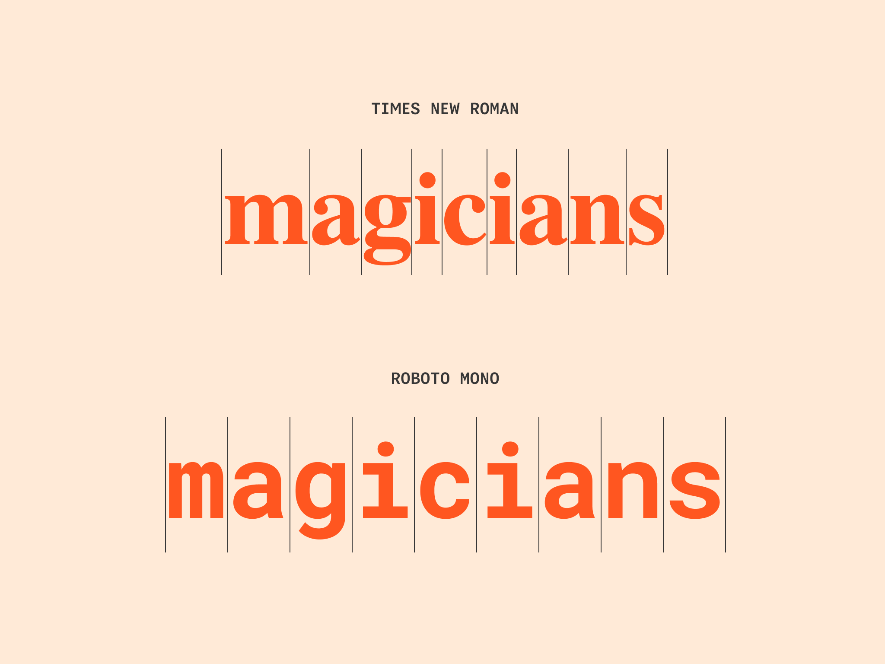
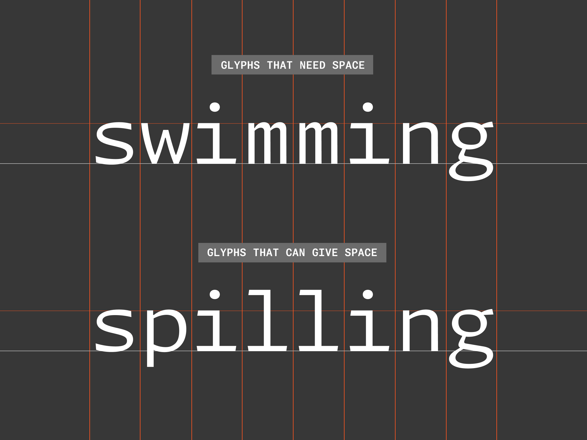
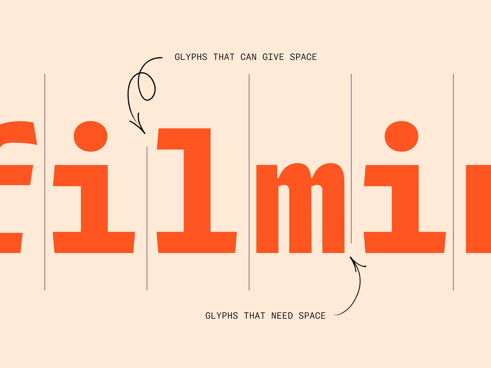
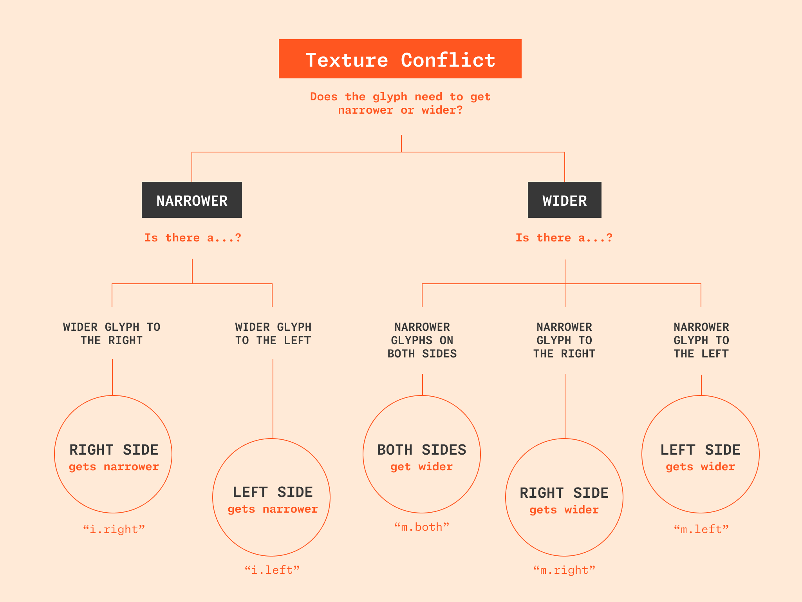
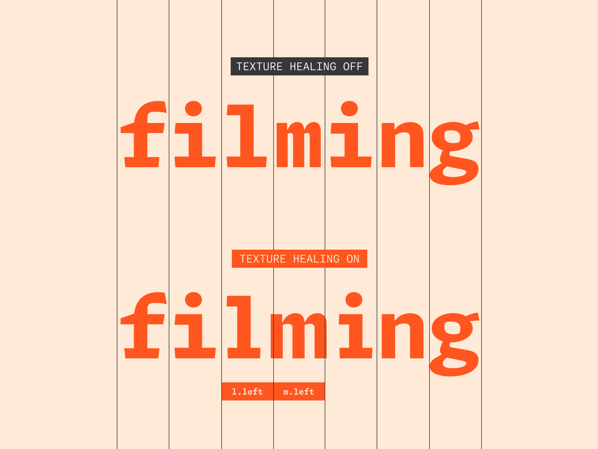
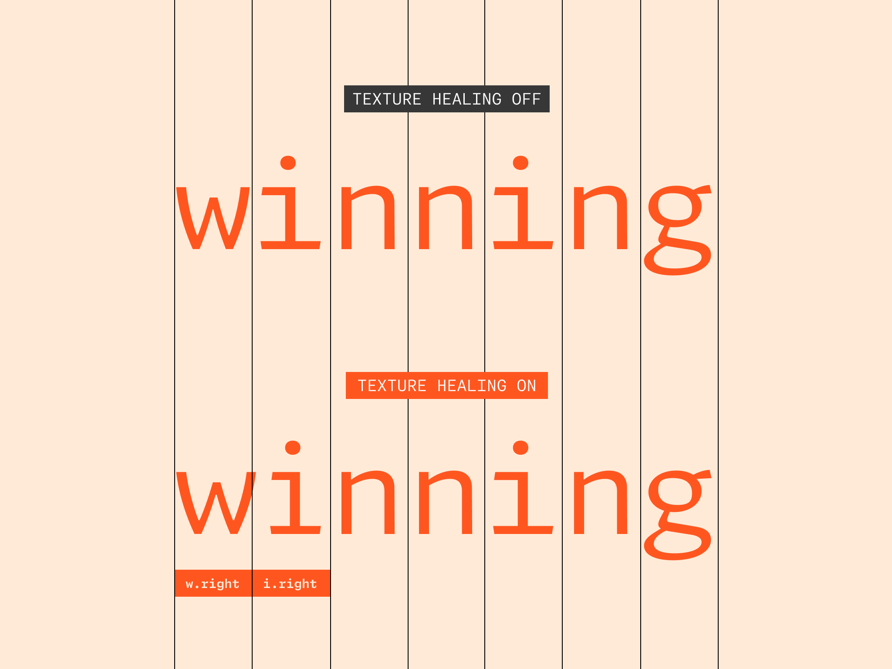
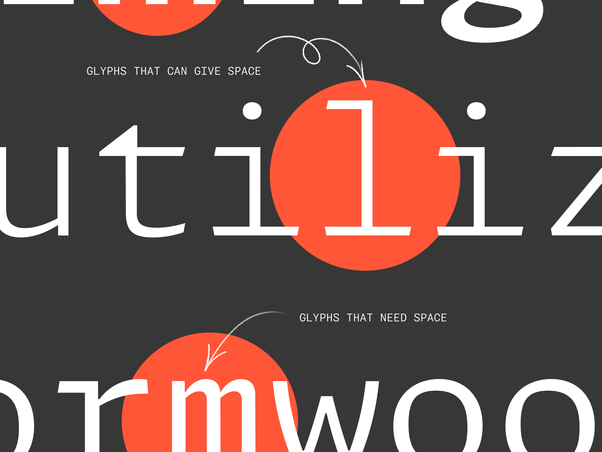
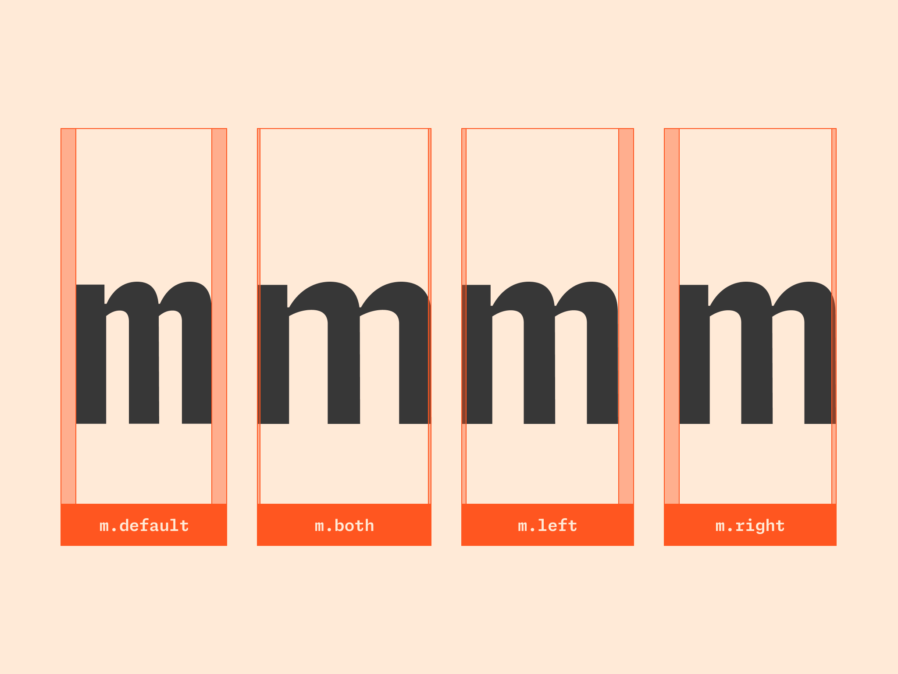
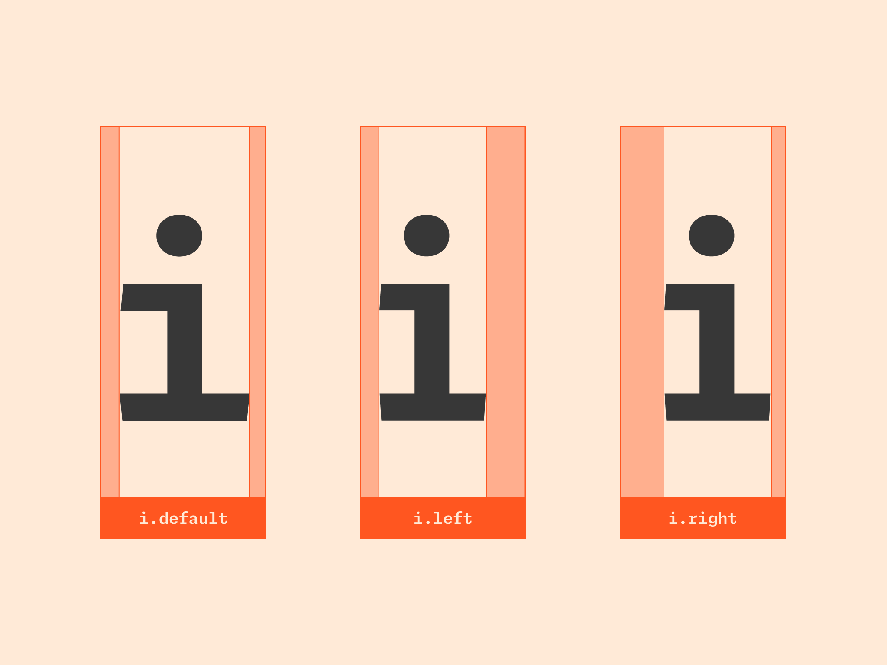

# Texture Healing Documentation

# Intro

Texture Healing is a feature created for the Github Type System series of Monospace fonts, by the team at Lettermatic. These fonts are open-sourced, and so we want to make sure that any future open-source contributors have the opportunity to add their own texture-healed glyphs. The source files for this project are being distributed in Glyphs 3 file format (.glyphs), so this guide assumes you will be using Glyphs.app. However the underlaying concepts can be implemented in any modern font editor.

# What is the inciting problem?

Monospace fonts involve glyphs which inherently have compromise in their design, some of which is unavoidable. Glyphs like ‘i’ that would typically be very narrow in a proportional design, feel quite wide when they are drawn to fit the desired monospace width. Similarly, glyphs like ‘m’ that are normally quite wide, tend to feel very narrow when drawn to fit the monospace constraint (fig. 2). These are largely unavoidable problems, this is simply inherent to the goals of making a monospace latin typeface.

*fig. 2*

I’ve come to think of the ‘m’ example as belonging to a category called ‘**glyphs that need space**’ (fig. 3). If more space was available, these glyphs would love to take up more space. Somehow anthropomorphizing the glyphs a bit helps to understand the ideas here. 

*fig. 3*

And in an inverse but related way, the ‘i’ example could belong to a category called ‘**glyphs that can give space**’. These glyphs have been given too much, and they’d like to donate some, if given the opportunity.

*fig. 4*

These categories of drawing in a monospace mean that a word like ‘swimming’ and a word like ‘spilling’ have a completely different amount of ‘air’ and ‘density’ to them, just via the nature of the glyph drawings and their coincidental combination in these words. However, there are occasionally situations in which one of these glyphs from the ‘glyphs that need space’ category is coincidentally directly next to a glyph from the ‘glyphs that can give space’ category. And it is these situations, precisely, where the concept of texture healing becomes relevant. Let’s call these situations in which two different compromises are next to each a ‘**Texture Conflict**’. A good example word would be ‘filming’ (fig. 4) where the ‘lm’ represents the **Texture Conflict**.

# Intro to Glyph Variations

One of the inherent problems with monospace fonts is, funnily enough, something we take for granted in most typeface design: the idea that there is just one version of every glyph. Disregarding script fonts, for instance, this is true of most fonts. If there is an ‘a’, there is just one unchanging ‘a’ that works in every situation. 

*fig. 6*

What if this were not true? Texture Healing relies on the idea that if there is, for instance a default ‘i’, it is also joined by some alternates (fig. 6). Rather than changing the aesthetic styling of the glyph, the glyph construction, or other qualities that typically call for an alternate, Texture Healing relies on alternates that shift to the left and right, without changing the glyph bounds. In other words, the body size of the alternate versions never changes, only the width and positioning of the drawing within the glyph body. 

# The Approach

At a high level, the steps of Texture Healing are:

1. Equip the font with variations for letters that are otherwise compromised, in which the compromise is lessened. 
2. Equip the font with an awareness of what a Texture Conflict is.
3. Tell the font to swap in alternate glyphs, itself, in the event that they may alleviate a Texture Conflict.

But what alternates do we need?

# Alternates for Glyphs That Can Give Space

The letter ‘i’ is in the ‘glyphs that can give space’ category. A Texture Healed font contains, for instance, 3 variations of the letter ‘i’ (fig. 8), each of which have narrower drawings to afford more space.

- i (default, designed to get along with every other glyph)
- i.left (narrower drawing, and purposefully sitting to the *left* of the glyph’s body)
- i.right (narrower drawing, and purposefully sitting to the *right* of the glyph’s body)

The default version is designed to function just as any monospace would, getting along with every other default glyph in a random order. The alternates, however, are designed to work in very specific contexts, and aren’t suitable to be used in place of defaults. 

*fig. 8*

# Alternates for Glyphs That Need Space

Let’s take another example. Do you remember that ‘m’ belongs to the category we called ‘glyphs that need space’? A texture healed font contains 4 variations of the letter ‘m’ (fig. 9), each of which are:

- m (default, designed to get along with every other glyph)
- m.left (wider drawing, and purposefully sitting to the *left* of the glyph’s body)
- m.right (wider drawing, and purposefully sitting to the *right* of the glyph’s body)
- m.both (the widest drawing variation, purposefully extending to both the left and the right concurrently).

With these alternates drawn, how do we make use of them? Why were they made in the first place?

*fig. 9*

# Healing Examples

In the word ‘filming’, the ‘l’ belongs to the ‘glyphs that can give space’ category, and is followed immediately by an ‘m’ which is in the ‘glyphs that need space’ category. In this situation, there is effectively a needless texture conflict, as these two glyphs (l and m) by default are compromised in inverted ways. What if the ‘l’ could donate some of its excess space to the ‘m’? And the ‘m’ could happily take up that space, to feel less cramped?

This sequence of glyphs: f, i, l, m, i, n, g

can be replaced with: f, i, l.left, m.left, i, n, g

Because the alternate glyphs never take up any more space, on a line of text, than their default siblings, the word length does not change at all, and the monospacing is preserved. However the ‘l’ looks more natural, and the ‘m’ looks less cramped, and the word has become more pleasant to read, as a result. 

---

Similar logic could be used for the word ‘winning’. 

This sequence of glyphs: w, i, n, n, i, n, g

can be replaced with: w.right, i.right, n, n, i, n, g

Although the direction, this time, is right instead of left, the results are similar in concept: the ‘w’ can now appear wider and therefore a bit more comfortable, and the ‘i’ is narrower which is more typical of an ‘i’ in (for instance) a proportional typeface.

Because these changes are happening based on categorical changes, the same logic that swaps ‘wi’ above would also change ‘mi’ in the exact same way.

# The OpenType Feature Code

The fundamentals of the OpenType feature code for Texture Healing involve a series of class definitions (representing the categories described earlier in this documentation), and a series of ‘lookups’, which are triggered in sequence.

This code is wrapped within the ‘calt’ feature, meaning Contextual Alternates. This is the same feature often used in, for instance, script fonts to swap a glyph in context when its construction will better suit the preceding or following glyphs. This is a very similar use, just with its own twist.

The feature code will be readily available, and thoroughly commented, in the .glyphs file that have been open sourced as part of this project, and naturally I recommend familiarizing yourself with that code.

Semantic names have been chosen for the OpenType classes, which reference the categorical concepts we’ve established, for instance you will see definitions for the following classes:

`@defaults_can_give_space`: If a glyph belongs to the ‘glyphs that can give space’ category, and alternates have been drawn for it, the default version should be in this class. For instance ‘i’ belongs here, as the default version of ‘i’. 

`@can_give_space_left`: This contains the .left variations of every glyph added to the `@defaults_can_give_space` class.

`@can_give_space_right`: This contains the .right variations of every glyph added to the `@defaults_can_give_space` class.

---

A note on OpenType classes: these are sequential containers. The order of elements does matter (very seriously) to the functionality, but the only way to specify an index for an element in the list is its actual order in the typed list. For instance if the ‘i’ is the 6th element in `@defaults_can_give_space` then the 6th element of `@can_give_space_left` should be ‘i.left’. The OpenType parser has no way, otherwise, to understand the association between these two glyphs.

---

`@defaults_can_take_space`: If a glyph belongs to the ‘glyphs that need space’ category, and alternates have been drawn for it, the default version should be in this class. For instance ‘m’ belongs here, as the default version of ‘m’. 

`@can_take_space_left:` This contains the .left variations of every glyph added to the `@defaults_can_take_space` class.

`@can_take_space_right`: This contains the .right variations of every glyph added to the `@defaults_can_take_space` class.

`@can_take_space_both`: This contains the .both variations of every glyph added to the `@defaults_can_take_space` class.

`@stationary`: This contains a list of glyphs which are not going to be swapped to alternates, but which should cause other glyphs near them to swap. This will be explained later on.

---

Once these classes are defined, a series of lookups are defined, such as:

**`lookup** defaultLeftPass {`

*`#if a glyph that can take space is to the left of a glyph that can give space, cause the glyph that can give space to extend to the right`*

*`#sample: im = i.left m;`*

**`sub** @defaults_can_give_space' @defaults_can_take_space **by** @can_give_space_left;`

`} defaultLeftPass;`

Each has been thoroughly commented to describe its purpose, using the # commenting syntax in OpenType feature code. Each contains a ‘#sample’ portion, which shows a hypothetical before/after swap in OpenType (as if the glyphs were hard-coded, when in fact the logic is class-based).

You can rely on the code to be self-documenting in this way, as each lookup describes what it does very clearly. Once all the lookups are defined, they are run in a specific order. Each lookup represents a complete pass on the available text when that feature is run, meaning that if the first lookup in the sequence causes glyphs to be swapped, then the second lookup will react to those changes. The consequential change of each lookup is parsed by the following lookup.

---

# In Practice: Glyphs That Need Space

Let’s follow the process to add a new texture healed glyph. The first thing that we need to decide is, if, indeed, the glyph needs texture healing. Does it feel uncomfortable in the monospace width, even when drawn correctly? Either via feeling too cramped or too airy?

*fig. 12*

Next, you need to sort this glyph into one of our two categories: Is it a ‘glyph that needs space’ or a ‘glyph that can give space’ (fig. 12)? 

Let’s pretend that we’ve just added the letter ‘m’ to our typeface, and we want to make sure it is texture healed (fig. 13). For the sake of this tutorial we are citing the ‘m’ as an example, but in its place you should imagine any glyph which belongs to the ‘glyphs that need space’ category.

We’re going to assume that you’ve already drawn your default version of the ‘m’, which means: the version that can work with every other glyph in the character set, where its width accounts for spacing relationships to arbitrary preceding/following characters. 

The next step would be to design the ‘.left’ and ‘.right’ versions. For ‘m.left’, the drawing should become wider than the default drawing, but the spacing on the right side should remain identical. In this sense, the ‘m.left’ glyph gets wider, leftwards. 

*fig. 13*

The ‘m.right’ variation does the same thing, but this time the left side bearing remains identical, the wider drawing now extends to the right. Still without moving the overall width of the ‘glyph body’ at all. 

Next you will need an ‘m.both’ variation which is the widest of all the variations, and it extends in both directions. The spacing is no longer the same on either side, and we have a sort of ‘maximum footprint’ version of the glyph via this version.

Next up you will need to add your new glyph to the relevant classes. In the case of your ‘m’, it is in the ‘glyphs that need space’ category, and so you would follow these steps:

1. Add the default ‘m’ to the class called `@defaults_can_take_space`
2. Add ‘m.left’ to `@can_take_space_left` at the same index position in the sequential list.
3. Add ‘m.right’ to `@can_take_space_right` at the same index position in the sequential list.
4. Add ‘m.both’ to `@can_take_space_both` at the same index position in the sequential list.

And there you have it! You have a texture healed glyph which will get wider when it neighbors glyphs that can give space.

# In Practice: Glyphs That Can Give Space

If you sorted your glyph into the other category ,‘glyphs that need space’, you will need to follow extremely similar steps, with some small differences. Let’s say that you were adding ‘i’, and therefore it falls into this other category (fig. 15).

When creating the .left and .right versions of your glyph, instead of making the drawings wider, the drawings will be narrower. When creating the .left variation, this time the left side bearing will remain the same, and the drawing will ‘scoot over’ to the left, as it gets narrower. 

*fig. 15*

The .right version follows the same logic, this time getting narrower rightwards. The bounding box of the glyph, its overall width or ‘body size’ remains the same. 

There is no .both variation for glyphs in this category, so that can be omitted. 

And the class sorting steps would be:

1. Add the default ‘i’ to the class called `@defaults_can_give_space`
2. Add ‘m.left’ to `@can_give_space_left` at the same index position in the sequential list.
3. Add ‘m.right’ to `@can_give_space_right` at the same index position in the sequential list.

And there we go! You have a texture healed glyph which will get narrower when it neighbors glyphs that need more space.

---